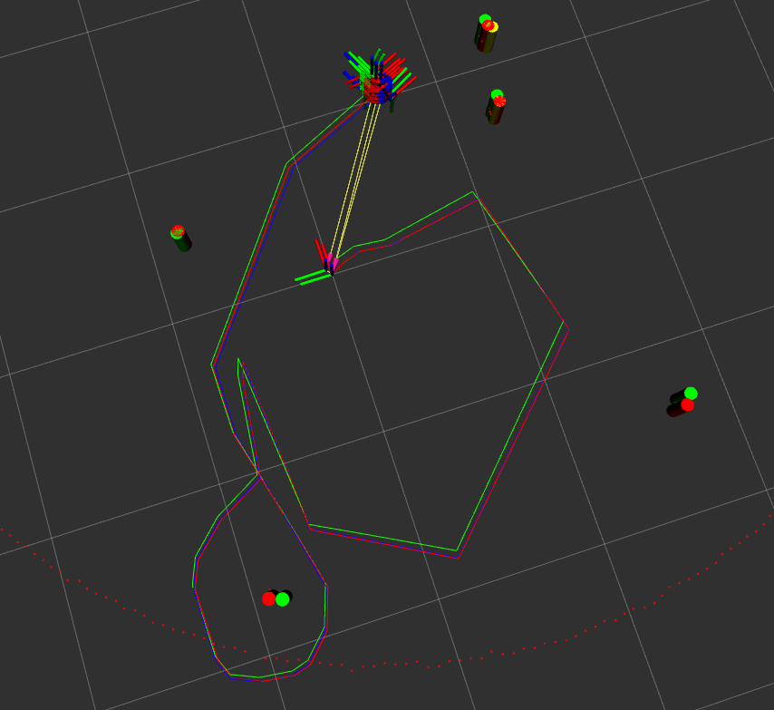

# NUSLAM

the nuslam package implements Extended Kalman Filter (EKF) SLAM for the turtlebot3. It fuses odometry with landmark observations to maintain a corrected estimate of the robot's pose and the positions of cylindrical obstacles in the environment. Green objects in rviz represent SLAM estimates; blue represents odometry-only (uncorrected); red represents ground truth from the simulator.

Launchfiles:

- slam.launch.xml
Launches the full SLAM stack. Starts the `slammer` node along with the simulator (or real robot), odometry, turtle_control, and optionally rviz. The `cmd_src`, `robot`, and `use_rviz` arguments control the configuration.

Parameters:

- obstacle_radius: Radius of the detected cylindrical obstacles (meters)
- map_id: Name of the map frame used for the SLAM-corrected pose
- odom_id: Name of the odometry frame

Launch Arguments:

- cmd_src: Source of velocity commands. Allowable: `circle`, `teleop`, `none` (default: `teleop`)
- robot: Robotic context. Allowable: `nusim` (simulated), `localhost` (real robot), `none` (default: `nusim`)
- use_rviz: Whether to launch RViz. Must be `false` when `robot:=localhost`. Allowable: `true`, `false` (default: `true`)
