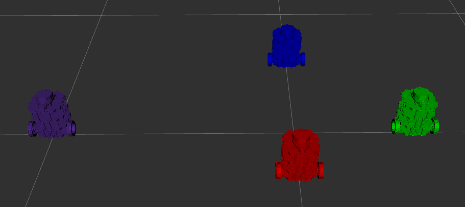

# Nuturtle  Description
URDF files for Nuturtle <turtlebot3_burger.urdf.xacro>
* `load_one.launch.xml` to see the robot in rviz.
* `load_all.launch.xml` to see four copies of the robot in rviz (each with a different color!).

* The rqt_graph when all four robots are visualized (Nodes Only, Hide Debug) is:

# Launch File Details
* `ros2 launch nuturtle_description load_one.launch.xml --show-args`
  `    'use_jsp':
        Set to true or false to determine whether default joint states are published.
        (default: 'true')

    'use_rviz':
        Set to true or false to determine whether to launch rviz.
        (default: 'true')

    'color':
        Color of the robot.
        (default: 'purple')
`
* `ros2 launch nuturtle_description load_all.launch.xml --show-args`
  `    'use_jsp':
        Set to true or false to determine whether default joint states are published.
        (default: 'true')

    'use_rviz':
        Set to true or false to determine whether to launch rviz.
        (default: 'true')

    'color':
        Color of the robot.
        (default: 'purple')
`